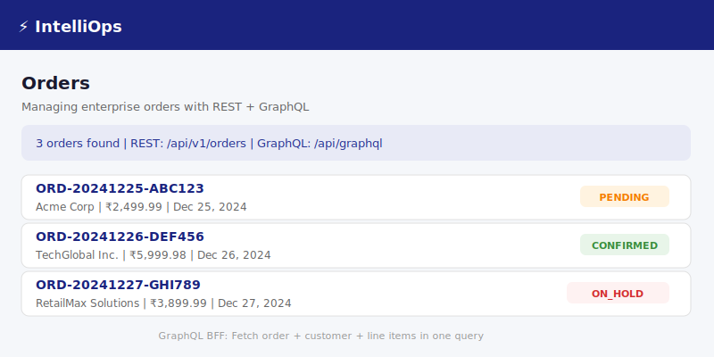
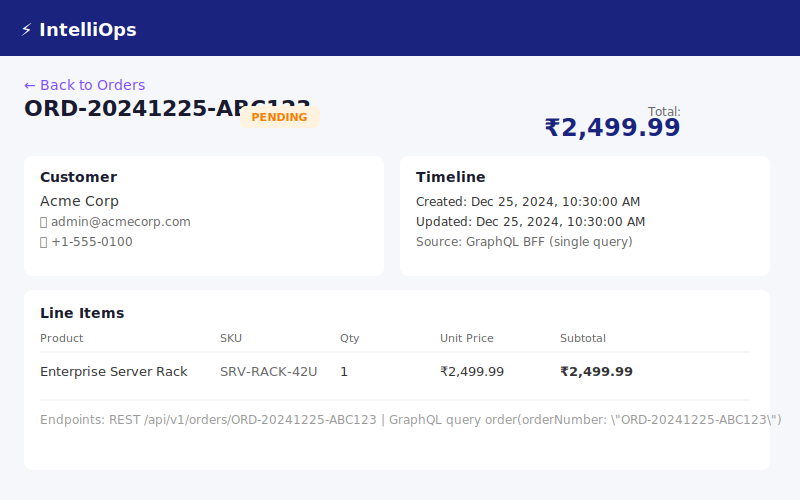
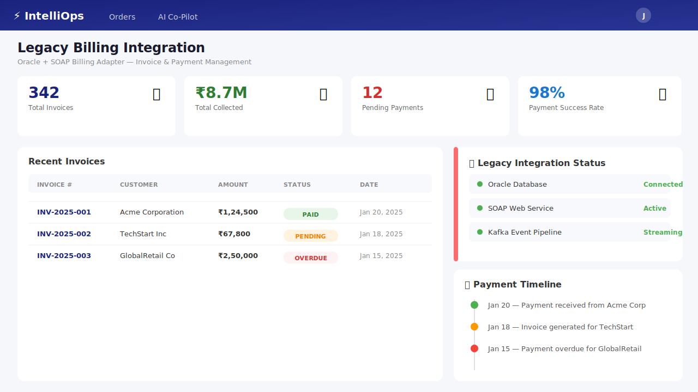

# ⚡ IntelliOps — AI-Powered Enterprise Operations Co-Pilot

[](https://adoptium.net/)
[](https://spring.io/projects/spring-boot)
[](https://angular.dev/)
[](https://www.postgresql.org/)
[](https://www.mongodb.com/)
[](https://graphql.org/)
[](https://ollama.ai/)

> **Large enterprises run order management, inventory, and billing on different systems** — often a mix of modern microservices and legacy platforms (Oracle + SOAP is extremely common in retail, telecom, banking, and insurance). When something goes wrong with an order, a support/ops engineer has to manually check 3-4 different systems, each with a different API style, plus search internal runbooks and FAQs to figure out what to do.
>
> **IntelliOps** is an AI co-pilot that sits on top of this landscape. A support engineer asks a question in plain English ("Why is order #4521 stuck, and has the customer been billed?"), and an AI agent retrieves relevant troubleshooting docs (RAG), calls the right backend services via standardized tool interfaces (MCP), and returns a synthesized answer with a recommended next action — all running on a locally-hosted LLM (Ollama) so no enterprise data leaves the network.

---

## 📸 Screenshots

| Order List Dashboard | Order Detail (GraphQL BFF) |
|:---:|:---:|
|  |  |

| AI Co-Pilot Chat | Legacy Billing Integration |
|:---:|:---:|
|  |  |

---

## 🏗️ Architecture

```
                        ┌─────────────────────────┐
                        │   Angular Frontend       │
                        │  (Co-pilot chat + admin  │
                        │   dashboards)            │
                        └───────────┬──────────────┘
                                     │ GraphQL (BFF) + REST + SSE/WebSocket
                                     ▼
        ┌─────────────────────────────────────────────────────┐
        │              AI Co-Pilot Service                     │
        │   Spring AI + LangChain4j + Ollama (local LLM)       │
        │   - RAG over runbooks/FAQs (pgvector)                │
        │   - Agent w/ tool calling                            │
        │   - Conversation memory (MongoDB)                    │
        └───────┬───────────────┬───────────────┬──────────────┘
                │ MCP            │ MCP           │ MCP
                ▼                ▼               ▼
     ┌──────────────────┐ ┌──────────────────┐ ┌──────────────────────┐
     │ Order Service     │ │ Inventory/Catalog │ │ Legacy Billing       │
     │ Spring Boot       │ │ Spring Boot       │ │ Adapter Service       │
     │ PostgreSQL        │ │ MongoDB           │ │ Oracle DB             │
     │ REST + GraphQL    │ │ gRPC (internal)   │ │ SOAP (legacy contract)│
     └────────┬──────────┘ └────────┬──────────┘ └───────────┬──────────┘
              │ Kafka events                                 │
              ▼                                               │
     ┌──────────────────────┐                                 │
     │ Notification/Activity│◄────────────────────────────────┘
     │ Service (Kafka)      │
     └──────────────────────┘
```

### Key Design Decisions

| Technology | Why | Tradeoff |
|-----------|-----|----------|
| **PostgreSQL** | ACID transactions for orders/payments; relational integrity (line items reference valid orders and products) | Fixed schema less flexible for varying product attributes |
| **MongoDB** | Product attributes vary wildly by category; document model fits "products with different shapes" naturally | No built-in joins; requires application-level aggregation |
| **GraphQL (BFF)** | Frontend needs order + customer + line items in one round trip; avoids over-fetching or building custom aggregation endpoints | Additional complexity vs. simple REST; must manage query depth |
| **gRPC** | Binary protocol + protobuf gives lower latency for the hot-path stock check call between Order Service and Inventory Service | Tight coupling on contract; harder to debug than REST/JSON |
| **REST** | Industry standard for external/partner APIs; versionable, cacheable | Less efficient than GraphQL for complex nested queries |
| **Oracle + SOAP** | Simulates a legacy enterprise system — extremely common in real companies (billing/ERP in telecom, banking, insurance) | High licensing cost; heavy protocol; only used here as an adapter pattern |
| **Kafka** | Decouples Order Service from notification logic; creates an audit trail the AI agent can query later | Operational complexity; at-least-once semantics require idempotent consumers |
| **Ollama** | Free, runs locally; no order/customer/billing data leaves the network | Smaller models than GPT-4; requires local GPU or sufficient RAM |

---

## 🧠 The Pitch (for interviews)

> Large enterprises run order management, inventory, and billing on different systems — often a mix of modern microservices and legacy platforms. When something goes wrong, a support engineer has to manually check 3-4 different systems, each with a different API style, plus search internal runbooks and FAQs.
>
> **IntelliOps is an AI co-pilot** that sits on top of this landscape. A support engineer asks a question in plain English, and an AI agent retrieves relevant troubleshooting docs (RAG), calls the right backend services via standardized tool interfaces (MCP), and returns a synthesized answer with a recommended next action — all running on a locally-hosted LLM (Ollama) so no enterprise data leaves the network.

---

## 🚀 Getting Started

### Prerequisites

- Java 17+ (Temurin JDK recommended)
- Maven 3.9+
- Node.js 20+
- Docker & Docker Compose
- Ollama (for AI features — [ollama.ai](https://ollama.ai))

### Quick Start

```bash
# 1. Build all services
mvn clean install -DskipTests

# 2. Start infrastructure (PostgreSQL, Kafka, etc.)
docker-compose up -d postgres kafka

# 3. Start Order Service
cd order-service
mvn spring-boot:run

# 4. Start Frontend (new terminal)
cd frontend/intellops-ui
npm install
ng serve
```

### API Endpoints

| Method | Endpoint | Description |
|--------|----------|-------------|
| `GET` | `/api/actuator/health` | Health check |
| `POST` | `/api/v1/customers` | Create customer |
| `GET` | `/api/v1/customers` | List customers |
| `POST` | `/api/v1/products` | Create product |
| `GET` | `/api/v1/products` | List products |
| `POST` | `/api/v1/orders` | Create order |
| `GET` | `/api/v1/orders/{orderNumber}` | Get order by number |
| `PATCH` | `/api/v1/orders/{orderNumber}/status` | Update order status |
| `GET` | `/api/graphiql` | GraphQL playground |

### GraphQL Example

```graphql
query GetOrderWithDetails {
  order(orderNumber: "ORD-20241225-ABC123") {
    orderNumber
    status
    totalAmount
    customer { name email }
    lineItems {
      quantity
      subtotal
      product { name sku price }
    }
  }
}
```

---

## 📦 Project Structure

```
intellops-platform/
├── order-service/                 # Order & Customer management (Phase 1)
│   ├── src/main/java/com/intellops/order/
│   │   ├── config/               # CORS, GraphQL, Kafka config
│   │   ├── controller/           # REST controllers
│   │   ├── dto/                  # Request/Response DTOs
│   │   ├── entity/               # JPA entities (Customer, Product, Order)
│   │   ├── exception/            # Global exception handler
│   │   ├── graphql/              # GraphQL query controllers
│   │   ├── repository/           # Spring Data JPA repositories
│   │   └── service/              # Business logic
│   └── src/main/resources/
│       ├── db/migration/         # Flyway migrations
│       └── graphql/              # GraphQL schema
├── frontend/
│   └── intellops-ui/             # Angular 17 SPA
├── docs/
│   ├── architecture.md           # Architecture docs & sequence diagrams
│   └── tech-decisions.md         # Technology decision log
├── .github/workflows/            # CI/CD pipelines
├── docker-compose.yml            # Full local dev environment
└── README.md                     # This file
```

---

## 🛠️ Tech Stack

| Layer | Technology |
|-------|-----------|
| **Backend** | Java 17, Spring Boot 3.2, Spring Data JPA |
| **API (External)** | REST (versionable, cacheable) |
| **API (BFF)** | GraphQL (single-round-trip queries) |
| **API (Internal)** | gRPC (low-latency service-to-service) |
| **Legacy API** | SOAP (Oracle adapter simulation) |
| **Database (Orders)** | PostgreSQL 16 (ACID, relational) |
| **Database (Catalog)** | MongoDB 7 (flexible schema) |
| **Database (Legacy)** | Oracle XE (simulated legacy) |
| **Cache** | Redis 7 |
| **Messaging** | Apache Kafka / Redpanda |
| **AI** | Ollama (llama3.1), Spring AI, LangChain4j |
| **Vector Store** | PostgreSQL + pgvector |
| **Frontend** | Angular 17, Apollo GraphQL |
| **Infra** | Docker Compose, AWS (ECS, RDS, MSK) |
| **CI/CD** | GitHub Actions |

---

## 📋 Build Phases

| Phase | Status | Description |
|-------|--------|-------------|
| **Phase 1** | ✅ Complete | Order Service (REST + GraphQL + PostgreSQL + Kafka), Angular skeleton, CI |
| **Phase 2** | ✅ Complete | Inventory Service (MongoDB + gRPC), product catalog, stock management, integration with Order Service |
| **Phase 3** | ✅ Complete | AI Co-Pilot core: LangChain4j + Ollama, RAG over pgvector, MCP tools for Order/Inventory, SSE streaming chat UI |
| **Phase 4** | ✅ Complete | Legacy Billing adapter (Oracle + SOAP), Kafka event pipeline |
| **Phase 5** | 📋 Planned | Full agent orchestration, conversation memory, dashboards |
| **Phase 6** | 📋 Planned | Dockerization, AWS deploy, polish docs & demo video |

---

## 👨‍💻 Author

**Anil** — Senior Full Stack Developer

Java | Spring Boot | Microservices | Angular | Kafka | Generative AI | RAG | Agent AI | Enterprise Architecture

---

## 📄 License

MIT
