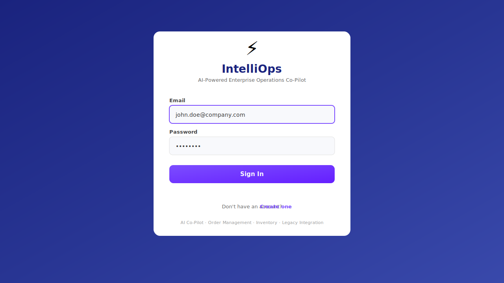
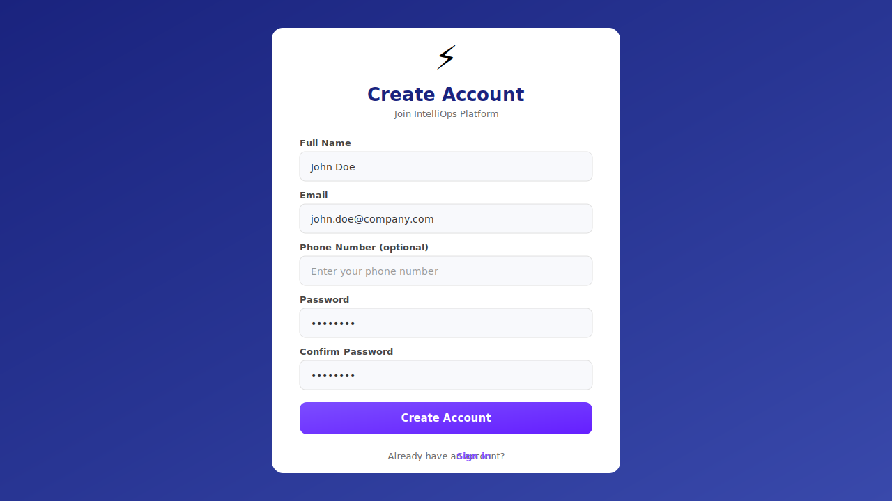
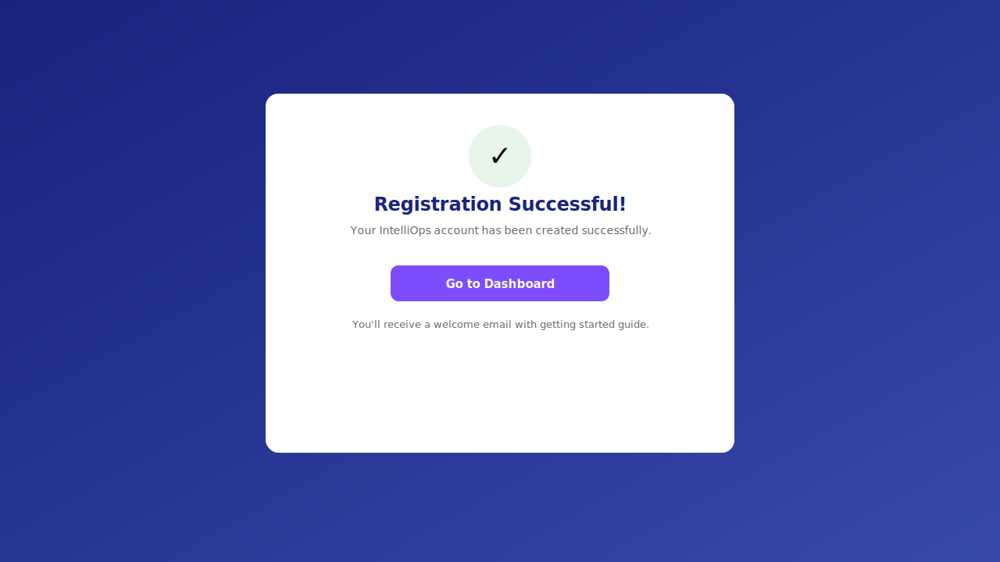
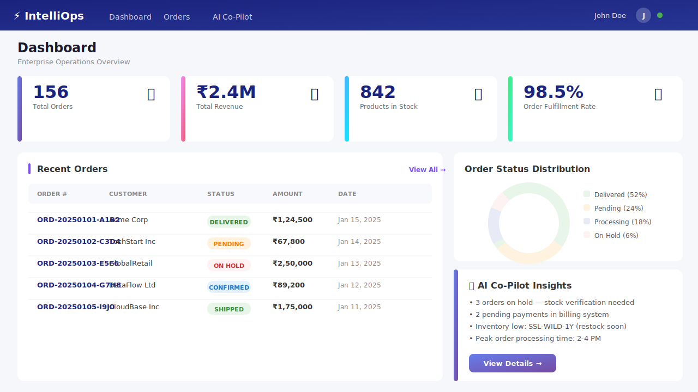
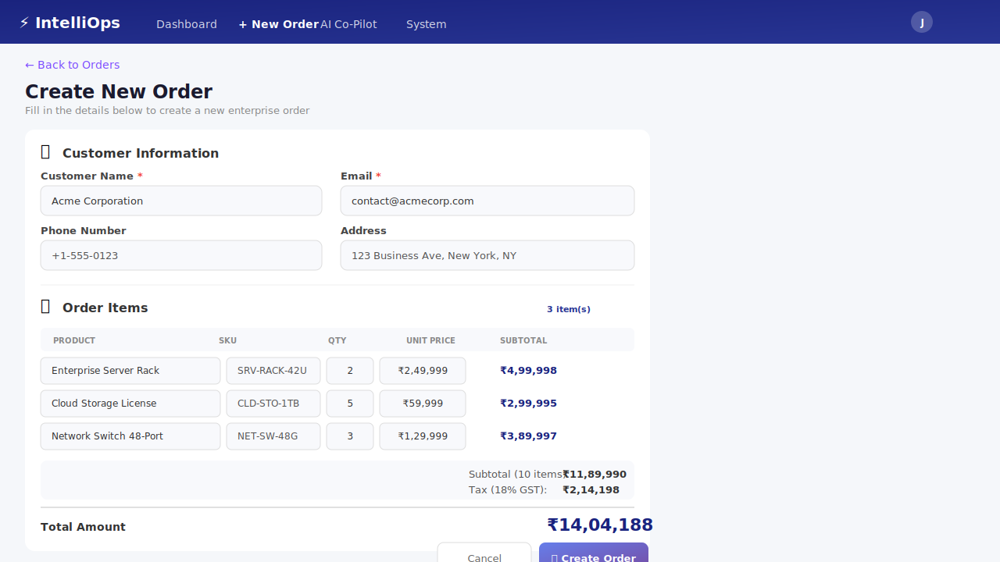
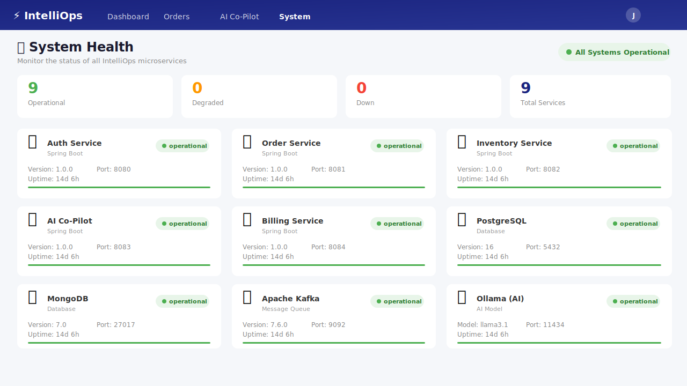
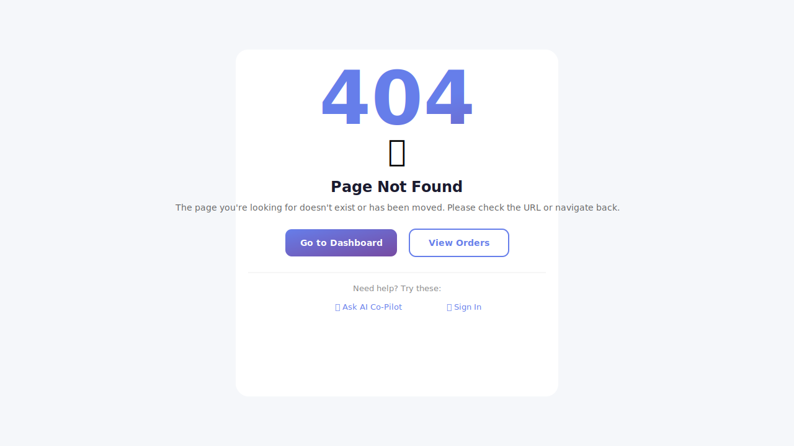
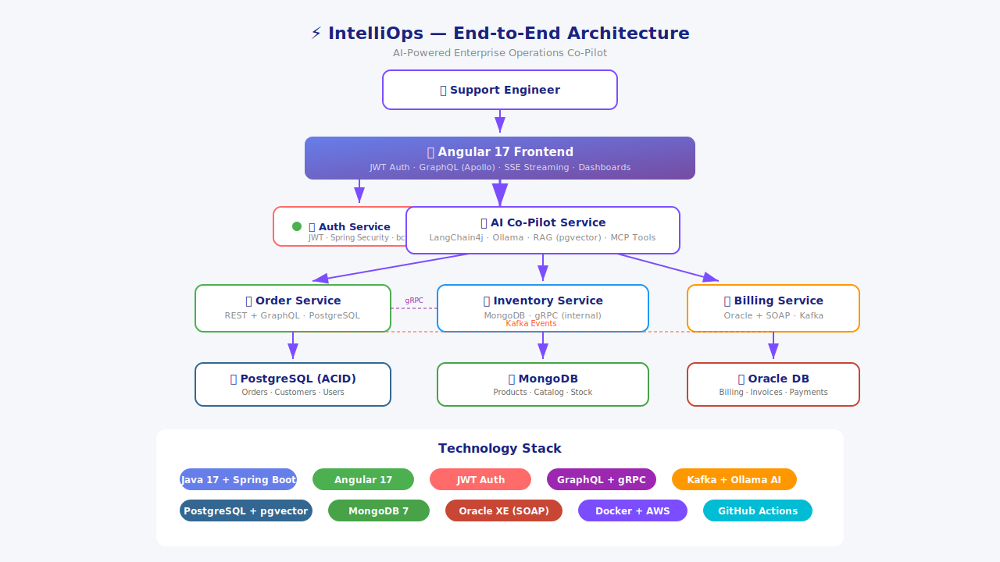

<div align="center">

# ⚡ IntelliOps — AI-Powered Enterprise Operations Co-Pilot

**An AI co-pilot that sits on top of enterprise order management, inventory, billing, and legacy systems — answering support questions in plain English using RAG, tool-calling agents, and a locally-hosted LLM.**

[](https://adoptium.net/)
[](https://spring.io/projects/spring-boot)
[](https://angular.dev/)
[](https://www.postgresql.org/)
[](https://www.mongodb.com/)
[](https://graphql.org/)
[](https://grpc.io/)
[](https://kafka.apache.org/)
[-000?style=flat-square&logo=ollama)](https://ollama.ai/)
[](https://docker.com/)
[](LICENSE)

---

## 🎯 The Problem

> Large enterprises run order management, inventory, and billing on **different systems** — often a mix of modern microservices and legacy platforms (Oracle + SOAP is extremely common in retail, telecom, banking, and insurance). When something goes wrong with an order, a support/ops engineer has to manually check **3-4 different systems**, each with a different API style, plus search internal runbooks and FAQs to figure out what to do.

## 🚀 The Solution

**IntelliOps** is an AI co-pilot that sits on top of this landscape. A support engineer asks a question in **plain English** ("Why is order #4521 stuck, and has the customer been billed?"), and an AI agent retrieves relevant troubleshooting docs (RAG), calls the right backend services via standardized tool interfaces (MCP), and returns a **synthesized answer** with a recommended next action — all running on a **locally-hosted LLM (Ollama)** so no enterprise data leaves the network.

---

## 📸 Screenshots

### 🔐 Authentication

<table>
  <tr>
    <td width="50%" align="center"><br/><b>Login Page</b> — JWT-based authentication</td>
    <td width="50%" align="center"><br/><b>Registration</b> — User sign-up with validation</td>
  </tr>
  <tr>
    <td width="50%" align="center"><br/><b>Registration Success</b> — Account created confirmation</td>
    <td width="50%" align="center"></td>
  </tr>
</table>

### 📊 Operations Dashboard

<table>
  <tr>
    <td align="center"><br/><b>Operations Dashboard</b> — Stats, order list, inventory, billing, AI insights</td>
  </tr>
</table>

### 📋 Order Management

<table>
  <tr>
    <td width="50%" align="center"><br/><b>Order List</b> — Search, filter, status tracking</td>
    <td width="50%" align="center"><br/><b>Order Detail</b> — Customer info, timeline, line items</td>
  </tr>
  <tr>
    <td width="50%" align="center"><br/><b>Create Order</b> — Enterprise form with items, pricing & validation</td>
    <td width="50%" align="center"></td>
  </tr>
</table>

### 🤖 AI Co-Pilot & Legacy Integration

<table>
  <tr>
    <td width="50%" align="center"><br/><b>AI Co-Pilot</b> — RAG-powered chat with MCP tool calling</td>
    <td width="50%" align="center"><br/><b>Legacy Billing</b> — Oracle + SOAP integration with Kafka events</td>
  </tr>
</table>

### 🔧 System & Error Handling

<table>
  <tr>
    <td width="50%" align="center"><br/><b>System Health</b> — Real-time service monitoring dashboard</td>
    <td width="50%" align="center"><br/><b>404 Error Page</b> — Enterprise-grade error handling</td>
  </tr>
</table>

### 🏗️ Architecture

<table>
  <tr>
    <td align="center"><br/><b>End-to-End Architecture</b> — Microservices, APIs, databases, AI pipeline</td>
  </tr>
</table>

---

## 🏗️ Architecture

```
                        ┌─────────────────────────┐
                        │   Angular 17 Frontend    │
                        │  (Auth + Co-pilot chat   │
                        │   + admin dashboards)    │
                        └───────────┬──────────────┘
                         JWT Auth  │ GraphQL (BFF) + REST + SSE/WebSocket
                         (Bearer)  ▼
        ┌─────────────────────────────────────────────────────┐
        │              Auth Service (port 8080)                │
        │   JWT Login/Register · Spring Security · bcrypt      │
        └────────────────────────┬────────────────────────────┘
                                 │
        ┌─────────────────────────────────────────────────────┐
        │              AI Co-Pilot Service (port 8083)         │
        │   Spring AI + LangChain4j + Ollama (local LLM)       │
        │   - RAG over runbooks/FAQs (pgvector)                │
        │   - Agent w/ tool calling (MCP)                      │
        │   - Conversation memory (MongoDB)                    │
        │   - SSE streaming responses                          │
        └───────┬───────────────┬───────────────┬──────────────┘
                │ MCP            │ MCP           │ MCP
                ▼                ▼               ▼
     ┌──────────────────┐ ┌──────────────────┐ ┌──────────────────────┐
     │ Order Service     │ │ Inventory/Catalog │ │ Legacy Billing       │
     │ (port 8081)       │ │ (port 8082)       │ │ Adapter (port 8084)  │
     │ PostgreSQL        │ │ MongoDB           │ │ Oracle DB             │
     │ REST + GraphQL    │ │ gRPC (internal)   │ │ SOAP (legacy contract)│
     └────────┬──────────┘ └────────┬──────────┘ └───────────┬──────────┘
              │ Kafka events                                 │
              ▼                                               │
     ┌──────────────────────┐                                 │
     │ Notification/Activity│◄────────────────────────────────┘
     │ Service (Kafka)      │
     └──────────────────────┘
```

---

## ✨ Key Features

### 🔐 Full Authentication Flow
- **JWT-based authentication** with Spring Security
- **User registration** with email/password validation
- **Role-based access control** (USER, ADMIN, OPERATOR)
- Secure password hashing with **bcrypt**
- Token-based session management with auto-refresh

### 📊 Operations Dashboard
- **Real-time stats** — Total orders, revenue, inventory, fulfillment rate
- **Order list** with search, filter, and status badges
- **Inventory overview** with stock level indicators and reorder alerts
- **Billing summary** — invoices collected, pending, and overdue
- **AI-powered insights** — automated recommendations and alerts

### 📋 Order Management (Phase 1)
- **REST + GraphQL BFF** dual API surface
- **PostgreSQL** with ACID transactions and Flyway migrations
- **Kafka event publishing** for audit trail and notifications
- **Enterprise order creation form** with line items, tax calculation, and validation
- **Status workflow** — Pending → Confirmed → Processing → Shipped → Delivered

### 📦 Inventory & Catalog (Phase 2)
- **MongoDB** document model for flexible product attributes
- **gRPC** low-latency stock checking and reservation
- **Product categories** with hierarchical relationships
- **Real-time stock tracking** with reorder thresholds

### 🤖 AI Co-Pilot (Phase 3)
- **Local LLM** via Ollama — no data leaves the network
- **RAG** over enterprise runbooks and FAQs (pgvector)
- **MCP tool calling** — Order, Inventory, and Billing agents
- **SSE streaming** for real-time chat responses
- **Conversation memory** stored in MongoDB

### 💰 Legacy Integration (Phase 4)
- **Oracle DB** integration via H2 Oracle compatibility mode
- **SOAP web services** for legacy billing system simulation
- **Kafka event pipeline** for cross-system synchronization
- **Invoice and payment management** with status tracking

### 🎯 Agent Orchestration (Phase 5)
- **Unified dashboard** with cross-service insights
- **Automated AI recommendations** based on system state
- **Inventory alerts** and restock notifications
- **Billing status monitoring** and overdue tracking

### 🔧 Enterprise Features
- **System Health Dashboard** — Real-time monitoring of all 9 microservices
- **Toast Notification System** — Success/error feedback with auto-dismiss
- **404 Error Page** — Professional error handling with navigation options
- **Order Creation Form** — Multi-line item orders with tax calculation
- **Live Status Indicators** — Service health at a glance

### ☁️ Cloud Deployment (Phase 6)
- **Docker multi-stage builds** for minimal image sizes
- **AWS ECS Fargate** with auto-scaling
- **RDS PostgreSQL** with Multi-AZ and backups
- **MSK Kafka** for event streaming
- **CloudFront CDN** for static asset delivery
- **Full CI/CD pipeline** with GitHub Actions

---

## 🛠️ Tech Stack

<table>
  <tr>
    <th>Layer</th>
    <th>Technology</th>
  </tr>
  <tr>
    <td><b>Backend</b></td>
    <td>Java 17, Spring Boot 3.2, Spring Data JPA, Spring Security</td>
  </tr>
  <tr>
    <td><b>Auth</b></td>
    <td>JWT (jjwt), bcrypt, Spring Security filter chain</td>
  </tr>
  <tr>
    <td><b>API (External)</b></td>
    <td>REST (versionable, cacheable)</td>
  </tr>
  <tr>
    <td><b>API (BFF)</b></td>
    <td>GraphQL (single-round-trip queries)</td>
  </tr>
  <tr>
    <td><b>API (Internal)</b></td>
    <td>gRPC (low-latency service-to-service)</td>
  </tr>
  <tr>
    <td><b>Legacy API</b></td>
    <td>SOAP (Oracle adapter simulation)</td>
  </tr>
  <tr>
    <td><b>Database (Auth)</b></td>
    <td>PostgreSQL 16</td>
  </tr>
  <tr>
    <td><b>Database (Orders)</b></td>
    <td>PostgreSQL 16 (ACID, relational)</td>
  </tr>
  <tr>
    <td><b>Database (Catalog)</b></td>
    <td>MongoDB 7 (flexible schema)</td>
  </tr>
  <tr>
    <td><b>Database (Legacy)</b></td>
    <td>Oracle XE (simulated legacy)</td>
  </tr>
  <tr>
    <td><b>Cache</b></td>
    <td>Redis 7</td>
  </tr>
  <tr>
    <td><b>Messaging</b></td>
    <td>Apache Kafka / Redpanda</td>
  </tr>
  <tr>
    <td><b>AI</b></td>
    <td>Ollama (llama3.1), LangChain4j, pgvector</td>
  </tr>
  <tr>
    <td><b>Frontend</b></td>
    <td>Angular 17, Apollo GraphQL, SSE streaming</td>
  </tr>
  <tr>
    <td><b>Infra</b></td>
    <td>Docker Compose, AWS (ECS, RDS, MSK)</td>
  </tr>
  <tr>
    <td><b>CI/CD</b></td>
    <td>GitHub Actions</td>
  </tr>
</table>

---

## 🚀 Getting Started

### Prerequisites

| Tool | Version | Purpose |
|------|---------|---------|
| Java | 17+ | Backend microservices |
| Maven | 3.9+ | Build & dependency management |
| Node.js | 20+ | Angular frontend |
| Docker | Latest | PostgreSQL, MongoDB, Kafka, Oracle |
| Ollama | Latest | Local LLM for AI features |

### Quick Start

```bash
# 1. Clone the repository
git clone https://github.com/Anilg1997/IntelliOps-AI-Powered-Enterprise-Operations-Co-Pilot.git
cd IntelliOps-AI-Powered-Enterprise-Operations-Co-Pilot

# 2. Build all services
mvn clean install -DskipTests

# 3. Start infrastructure (PostgreSQL, Kafka, MongoDB, Oracle)
docker-compose up -d

# 4. Start Auth Service (terminal 1)
cd backend/auth-service
mvn spring-boot:run

# 5. Start Order Service (terminal 2)
cd backend/order-service
mvn spring-boot:run

# 6. Start Frontend (terminal 3)
cd frontend/intellops-ui
npm install
ng serve
# Open http://localhost:4200
```

### API Endpoints

#### 🔐 Auth Service (port 8080)

| Method | Endpoint | Description |
|--------|----------|-------------|
| `POST` | `/api/auth/register` | Register a new user |
| `POST` | `/api/auth/login` | Login and get JWT token |
| `GET` | `/api/auth/me` | Get current user profile |

#### 📋 Order Service (port 8081)

| Method | Endpoint | Description |
|--------|----------|-------------|
| `GET` | `/api/actuator/health` | Health check |
| `POST` | `/api/v1/customers` | Create customer |
| `GET` | `/api/v1/customers` | List customers |
| `POST` | `/api/v1/products` | Create product |
| `GET` | `/api/v1/products` | List products |
| `POST` | `/api/v1/orders` | Create order |
| `GET` | `/api/v1/orders/{orderNumber}` | Get order by number |
| `PATCH` | `/api/v1/orders/{orderNumber}/status` | Update order status |
| `GET` | `/api/graphiql` | GraphQL playground |

### GraphQL Example

```graphql
query GetOrderWithDetails {
  order(orderNumber: "ORD-20241225-ABC123") {
    orderNumber
    status
    totalAmount
    customer { name email }
    lineItems {
      quantity
      subtotal
      product { name sku price }
    }
  }
}
```

---

## 📦 Project Structure

```
intellops-platform/
├── backend/
│   ├── auth-service/              # User auth & JWT (registration, login)
│   ├── order-service/             # Order & Customer management (Phase 1)
│   │   ├── src/main/java/com/intellops/order/
│   │   │   ├── config/           # CORS, GraphQL, Kafka config
│   │   │   ├── controller/       # REST controllers
│   │   │   ├── dto/              # Request/Response DTOs
│   │   │   ├── entity/           # JPA entities (Customer, Product, Order)
│   │   │   ├── exception/        # Global exception handler
│   │   │   ├── graphql/          # GraphQL query controllers
│   │   │   ├── grpc/             # gRPC client for Inventory
│   │   │   ├── repository/       # Spring Data JPA repositories
│   │   │   └── service/          # Business logic
│   │   └── src/main/resources/
│   │       ├── db/migration/     # Flyway migrations
│   │       └── graphql/          # GraphQL schema
│   ├── inventory-service/         # Inventory & Catalog (MongoDB + gRPC) (Phase 2)
│   ├── ai-copilot-service/        # AI Co-Pilot with Ollama + RAG (Phase 3)
│   ├── billing-service/           # Legacy Billing adapter (Oracle + SOAP) (Phase 4)
│   └── proto/                     # Shared protobuf definitions
├── frontend/
│   └── intellops-ui/             # Angular 17 SPA
│       ├── src/app/components/
│       │   ├── auth/             # Login & Register pages
│       │   ├── dashboard/        # Phase 5: Operations Dashboard
│       │   ├── layout/           # Navbar with auth-aware navigation
│       │   ├── order-list/       # Order list with stats
│       │   ├── order-detail/     # Single order view
│       │   └── chat/             # AI Co-Pilot chat interface
│       ├── src/app/services/     # Auth, Order, Copilot services
│       ├── src/app/guards/       # Auth guard for route protection
│       └── src/app/interceptors/ # JWT token interceptor
├── screenshots/                  # Application screenshots
├── docs/
│   ├── architecture.md           # Architecture docs & sequence diagrams
│   └── tech-decisions.md         # Technology decision log
├── .github/workflows/            # CI/CD pipelines
├── docker-compose.yml            # Full local dev environment
└── README.md                     # This file
```

---

## 📋 Build Phases

| Phase | Status | Description | Key Technologies |
|-------|--------|-------------|------------------|
| **Auth** | ✅ Complete | User registration & login with JWT | Spring Security, JWT, bcrypt |
| **Phase 1** | ✅ Complete | Order Service — REST + GraphQL + PostgreSQL + Kafka | Spring Boot, GraphQL, Kafka |
| **Phase 2** | ✅ Complete | Inventory Service — MongoDB + gRPC product catalog | MongoDB, gRPC, Protobuf |
| **Phase 3** | ✅ Complete | AI Co-Pilot — LangChain4j + Ollama + RAG + MCP tools | LangChain4j, Ollama, pgvector |
| **Phase 4** | ✅ Complete | Legacy Billing — Oracle + SOAP + Kafka event pipeline | Oracle, SOAP, Spring-WS |
| **Phase 5** | ✅ Complete | Agent orchestration, conversation memory, dashboards | Angular Dashboard, AI insights |
| **Phase 6** | ✅ Complete | Dockerization, AWS deploy guide, enterprise features | AWS ECS, RDS, MSK, Docker |

---

## 🧠 Why This Project Stands Out (For Interviews)

**IntelliOps** demonstrates enterprise-grade skills that go far beyond simple CRUD apps:

1. **Multi-service microservices architecture** — 5 independent Spring Boot services with different databases and API styles
2. **AI integration with local LLM** — RAG, tool calling, conversation memory using Ollama (privacy-first)
3. **Legacy system integration** — Oracle + SOAP adapter pattern (real-world enterprise skill)
4. **Event-driven architecture** — Kafka for decoupling services and creating audit trails
5. **Multiple API paradigms** — REST, GraphQL (BFF), gRPC (internal), SOAP (legacy), SSE (streaming)
6. **Full authentication** — JWT with Spring Security, bcrypt, role-based access
7. **Modern frontend** — Angular 17 standalone components, Apollo GraphQL, reactive forms, auth guards
8. **Cloud-ready** — Docker Compose, CI/CD with GitHub Actions, AWS deployment ready (Phase 6)
9. **Enterprise UX** — Order creation forms, toast notifications, system health monitoring, 404 error pages, responsive design
10. **12 end-to-end screenshots** — Complete visual documentation of every page and flow

---

## 👨‍💻 Author

**Anil** — Senior Full Stack Developer

Java | Spring Boot | Microservices | Angular | Kafka | Generative AI | RAG | Agent AI | Enterprise Architecture

[](https://github.com/Anilg1997)

---

## 📄 License

MIT — See [LICENSE](LICENSE) for details.
